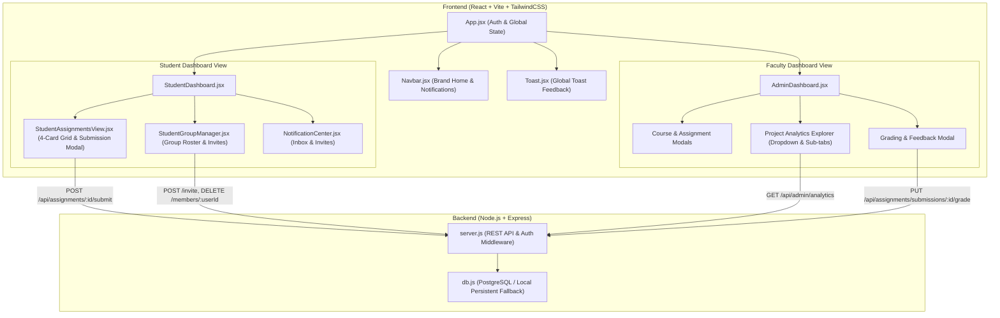

# Joineazy - Student Coursework & Study Group Platform 🎓

A modern, full-stack collaborative educational portal that connects students and professors. Joineazy simplifies coursework distribution, group collaboration, submission workflows with Group Leader authority, Question Paper PDF distribution, and faculty analytics.

---

## 📑 Table of Contents
- [✨ Key Features](#-key-features)
- [🎨 UI/UX Design Choices & Philosophy](#-uiux-design-choices--philosophy)
- [🏗️ Component Architecture & System Diagram](#️-component-architecture--system-diagram)
- [🚀 Local Setup & Installation](#-local-setup--installation)
- [🖥️ UI Walkthrough & Flow](#️-ui-walkthrough--flow)
- [🗄️ Database & API Schema](#️-database--api-schema)
- [🌐 Deployment (Vercel)](#-deployment-vercel)

---

## ✨ Key Features

1. **Dual Role Portals**:
   - **Student Portal**: Coursework cards, Study Group formation and invitations, OneDrive submission flows, and real-time grades.
   - **Professor / Admin Portal**: Course builder, Assignment publisher (targeted to entire classes or specific study groups), Question Paper PDF uploads, Real-time Analytics Explorer, and in-line grading with teacher feedback.
2. **Group Leader Submission Authority**:
   - For group-targeted coursework, only the designated **Group Leader / Creator** can acknowledge and confirm submission.
   - Submissions automatically synchronize and mark coursework as completed across all group members.
3. **Interactive Project & Assignment Analytics**:
   - Coursework selection dropdown list with completion ratios.
   - Dedicated inspection sub-tabs: **Submitted Students** (with study group badges) and **Not Submitted / Overdue** (with deadline expiration alerts).
   - Member-by-member group progress breakdown.
4. **Study Group Collaboration**:
   - Create study groups, invite classmates via email or roll number, and manage member rosters with member removal and voluntary leave options.
5. **Universal Feedback & Notifications**:
   - Toast feedback alerts on all actions and errors.
   - In-app notification center for group invitations, submission confirmations, removals, and faculty grades.

---

## 🎨 UI/UX Design Choices & Philosophy

| Design Choice | Rationale & UX Benefit |
| :--- | :--- |
| **4-Card Responsive Grid Layout** | In the Student Coursework section, assignments are organized into a 4-card-per-row grid (`grid-cols-1 sm:grid-cols-2 lg:grid-cols-3 xl:grid-cols-4`). This maximizes information density while keeping task descriptions, due dates, question paper download buttons, and status tags clean and scannable. |
| **Tailored Color Hierarchy** | Avoids generic primary colors in favor of an intentional palette: **Indigo** (`#4F46E5`) for primary actions and brand identity; **Emerald** (`#059669`) for confirmed submissions and active states; **Amber** (`#D97706`) for pending tasks and deadlines; **Rose** (`#E11D48`) for past-due/overdue alerts and destructive actions; **Purple** (`#7C3AED`) for study groups and leader badges. |
| **Group Leader Submission Authority Model** | Prevents confusing duplicate submissions in collaborative projects. Group members clearly see `🔒 Awaiting Group Leader Confirmation`, while the Group Leader has the authority button `👑 Submit Group Work`. Confirmation immediately reflects across all group members' dashboards. |
| **Project Analytics Dropdown & Sub-Tabs** | Allows professors to switch between assignments from a dropdown list. The breakdown is split into three tabs: `✓ Submitted ({count})`, `⏳ Not Submitted ({count})`, and `👥 Group Progress ({count})` with deadline indicators and in-line grading modal triggers. |
| **Frictionless Navigation & Back Options** | Clicking the **Joineazy** logo in the navigation bar returns the user to the home dashboard view. Every modal, inbox, and management drawer includes back buttons (`ArrowLeft`) and backdrop dismissal. |
| **Anchored Popovers with Past Date Validation** | Date selection popovers prevent selecting past dates for assignments, preventing scheduling errors. |
| **Centralized Toast Notification System** | Replaces jarring browser `alert()` popups with subtle slide-in toast notifications that automatically dismiss. |

---

## 🏗️ Component Architecture & System Diagram

### Architecture Diagram



### Component Structure Breakdown

- **`App.jsx`**: Root component managing user authentication state (JWT stored in `localStorage`), active role switching, and global `navHomeTrigger`.
- **`Navbar.jsx`**: Top navigation with clickable brand home link, profile info, unread notification counter badge, and logout action.
- **`StudentDashboard.jsx`**: Main student portal switching between Overview, Coursework, Study Groups, and Profile.
- **`StudentAssignmentsView.jsx`**: 4-card coursework layout with Question Paper PDF downloads, OneDrive links, Group Leader submission authority logic, and 2-step confirmation modal.
- **`StudentGroupManager.jsx`**: Study group manager with search, invites via email/roll number, active member lists, and leader member removal options.
- **`AdminDashboard.jsx`**: Comprehensive faculty workspace including Course manager, Assignment distributor, Project Analytics Explorer, and in-line grading suite.
- **`NotificationCenter.jsx`**: Real-time notification drawer supporting group invitation accept/decline actions and submission notices.
- **`AnchoredPopover.jsx`**: Calendar and time picker with past-date prevention.
- **`Toast.jsx`**: Global toast feedback provider for action confirmations and error reporting.

---

## 🚀 Local Setup & Installation

Follow these steps to run both the frontend and backend locally on your machine.

### Prerequisites
- **Node.js** (v18.0.0 or higher recommended)
- **npm** (v9.0.0 or higher)
- *(Optional)* **PostgreSQL** database (a built-in persistent local fallback database is automatically included if no PostgreSQL database is configured).

---

### Step 1: Clone the Repository
```bash
git clone https://github.com/jojo-manuel/jojo-manuel-p-task1.git
cd jojo-manuel-p-task1
```

---

### Step 2: Backend Setup
```bash
# Navigate to backend directory
cd backend

# Install dependencies
npm install

# (Optional) Create .env file or use default configuration
# PORT=5001
# JWT_SECRET=joineazy_super_secret_jwt_key_2026
# DATABASE_URL=postgresql://... (optional)

# Start backend server
npm run dev
# Or: node server.js
```
*The backend API server will start on `http://localhost:5001`.*

---

### Step 3: Frontend Setup
Open a new terminal window:
```bash
# Navigate to frontend directory
cd frontend

# Install dependencies
npm install

# Start Vite dev server
npm run dev
```
*The frontend application will start on `http://localhost:5174` (or `http://localhost:5173`).*

---

### Step 4: Access the Application
Open your browser and navigate to:
```
http://localhost:5174
```

---

### 🔑 Demo Testing Accounts

| Role | Email | Password | Details |
| :--- | :--- | :--- | :--- |
| **Professor / Admin** | `teacher@example.com` | `password123` | Full access to create courses, assignments, view project analytics, and grade submissions. |
| **Student (Group Leader)** | `student@example.com` | `password123` | Student account with existing study group creator authority and coursework. |
| **Student (Member)** | `student2@example.com` | `password123` | Classmate account to test group invitations and cross-member submission sync. |

*(You can also click **"Sign up"** to create a fresh student or faculty account at any time).*

---

## 🖥️ UI Walkthrough & Flow

### 1. Authentication & Role Selection
```
┌─────────────────────────────────────────────────────────────┐
│                       🎓 Joineazy                           │
│             Log in to your educational account              │
│                                                             │
│  [ Email Address: student@example.com                     ] │
│  [ Password:      ••••••••••••                            ] │
│                                                             │
│  [            Log In to Joineazy                         ]  │
│  [ G  Sign in with Google                                ]  │
│                                                             │
│  New to Joineazy? [Create Student Account] [Faculty Portal] │
└─────────────────────────────────────────────────────────────┘
```

---

### 2. Student Coursework Page (4-Card Grid)
```
┌─────────────────────────────────────────────────────────────────────────────────────────────┐
│ 📚 Coursework Assignments               [All (4)]  [Pending (2)]  [Completed (1)]  [Missed (1)]│
├──────────────────────────┬──────────────────────────┬──────────────────────────┬────────────┤
│ 🟣 Group Assignment     │ 🔵 Individual Assignment │ 🟣 Group Assignment     │ ...        │
│ [PHY-101] Physics Lab   │ [CS-201] Data Structures │ [CHEM-301] Organic Lab  │            │
│ ⏰ Due: Tomorrow 5:00 PM │ ⏰ Due: Oct 15, 2:00 PM  │ ⏰ Due: Past Due         │            │
│                         │                          │                          │            │
│ Quantum Optics Lab 2    │ Binary Search Tree Impl  │ Synthesis Report 4       │            │
│ Download question paper │ Upload code to OneDrive  │ Complete synthesis steps │            │
│ [📄 View PDF]           │ [📁 Open OneDrive]       │ [📁 Open OneDrive]       │            │
│                         │                          │                          │            │
│ Group: Quantum Squad    │                          │ Group: BioChem Team      │            │
│ [████████░░] 75% Done   │                          │ ⚠ Missed Deadline        │            │
│                         │                          │                          │            │
│ 👑 Submit Group Work    │ [Submit & Confirm Work]  │ 🛡️ Confirmed by Leader  │            │
└──────────────────────────┴──────────────────────────┴──────────────────────────┴────────────┘
```

---

### 3. Faculty Project & Assignment Analytics Explorer
```
┌─────────────────────────────────────────────────────────────────────────────────────────────┐
│ 📊 Project & Assignment Analytics                                     [4 Total Projects]    │
│                                                                                             │
│ Select Assignment / Coursework Project:                                                     │
│ [ [PHY-101] Quantum Optics Lab 2 — (18 / 24 Submitted · 75% Done)                       ▼ ] │
├─────────────────────────────────────────────────────────────────────────────────────────────┤
│ 🎯 Target Students: 24   │  ✅ Submitted: 18 (75%)   │  ⏳ Pending: 6 (25%)                   │
│ Project Progress: [████████████████████░░░░░░░] 75% Completed                               │
├─────────────────────────────────────────────────────────────────────────────────────────────┤
│  [ ✓ Submitted Students (18) ]  [ ⏳ Not Submitted / Overdue (6) ]  [ 👥 Group Progress (3) ]│
│                                                                                             │
│  • Eleanor Vance (eleanor@univ.edu) · Roll #1024 · 👥 Group: Alpha Team · [✓ Submitted]     │
│    Submitted: Oct 12, 3:45 PM · [Open Link] · [+ Grade & Feedback]                          │
│                                                                                             │
│  • Marcus Thorne (marcus@univ.edu) · Roll #1029 · 👥 Group: Beta Squad · [✓ Submitted]      │
│    Submitted: Oct 12, 4:10 PM · [Open Link] · [Grade: 95/100]                               │
└─────────────────────────────────────────────────────────────────────────────────────────────┘
```

---

## 🗄️ Database & API Schema

### Core Tables & Models

```sql
-- Users (Students & Faculty)
CREATE TABLE users (
  id SERIAL PRIMARY KEY,
  name VARCHAR(255),
  email VARCHAR(255) UNIQUE NOT NULL,
  password_hash VARCHAR(255),
  role VARCHAR(50) DEFAULT 'student',
  roll_number VARCHAR(100),
  phone_number VARCHAR(50),
  school VARCHAR(255),
  class_name VARCHAR(100),
  google_id VARCHAR(255),
  created_at TIMESTAMP WITH TIME ZONE DEFAULT CURRENT_TIMESTAMP
);

-- Study Groups
CREATE TABLE groups (
  id SERIAL PRIMARY KEY,
  name VARCHAR(255) NOT NULL,
  description TEXT,
  created_by INTEGER REFERENCES users(id),
  leader_id INTEGER,
  created_at TIMESTAMP WITH TIME ZONE DEFAULT CURRENT_TIMESTAMP
);

-- Group Members
CREATE TABLE group_members (
  id SERIAL PRIMARY KEY,
  group_id INTEGER REFERENCES groups(id),
  user_id INTEGER REFERENCES users(id),
  role VARCHAR(50) DEFAULT 'member', -- 'creator', 'leader', 'member'
  status VARCHAR(50) DEFAULT 'pending', -- 'accepted', 'pending'
  created_at TIMESTAMP WITH TIME ZONE DEFAULT CURRENT_TIMESTAMP
);

-- Coursework Assignments
CREATE TABLE assignments (
  id SERIAL PRIMARY KEY,
  title VARCHAR(255) NOT NULL,
  description TEXT,
  due_date TIMESTAMP WITH TIME ZONE,
  onedrive_link VARCHAR(500),
  assigned_to_type VARCHAR(50) DEFAULT 'all', -- 'all', 'groups'
  assigned_group_ids TEXT,
  question_paper_url TEXT,
  question_paper_name VARCHAR(255),
  course_name VARCHAR(255) DEFAULT 'General Coursework',
  created_by INTEGER REFERENCES users(id),
  created_at TIMESTAMP WITH TIME ZONE DEFAULT CURRENT_TIMESTAMP
);

-- Assignment Submissions
CREATE TABLE assignment_submissions (
  id SERIAL PRIMARY KEY,
  assignment_id INTEGER REFERENCES assignments(id),
  student_id INTEGER REFERENCES users(id),
  group_id INTEGER REFERENCES groups(id),
  status VARCHAR(50) DEFAULT 'submitted',
  submission_link VARCHAR(500),
  submission_notes TEXT,
  grade VARCHAR(50),
  feedback TEXT,
  graded_at TIMESTAMP WITH TIME ZONE,
  submitted_at TIMESTAMP WITH TIME ZONE DEFAULT CURRENT_TIMESTAMP
);
```

### Key API Endpoints

| Method | Route | Access | Description |
| :--- | :--- | :--- | :--- |
| `POST` | `/api/auth/register` | Public | Register new student or teacher account |
| `POST` | `/api/auth/login` | Public | Authenticate with email & password |
| `GET` | `/api/assignments` | Authenticated | List all coursework assigned to user or their groups |
| `POST` | `/api/assignments` | Faculty/Admin | Create assignment with optional PDF and target groups |
| `POST` | `/api/assignments/:id/submit` | Student (Leader) | Submit coursework (syncs across group if group project) |
| `GET` | `/api/admin/analytics` | Faculty/Admin | Get detailed assignment metrics, submitted vs overdue lists |
| `PUT` | `/api/assignments/submissions/:id/grade` | Faculty/Admin | Assign grade and personalized feedback |
| `GET` | `/api/groups` | Authenticated | List user's study groups with member progress |
| `POST` | `/api/groups/:id/invite` | Group Member | Invite student by email or roll number |
| `DELETE`| `/api/groups/:id/members/:userId` | Leader/Self | Remove member from study group or leave group |
| `GET` | `/api/notifications` | Authenticated | Fetch in-app notifications and invitation alerts |

---

## 🌐 Deployment (Vercel)

The repository is configured for automated full-stack deployment on **Vercel** with a single root configuration (`vercel.json`).

### Environment Variables required on Vercel:
- `DATABASE_URL`: PostgreSQL / Neon Connection String
- `JWT_SECRET`: Secret key for JWT session verification
- `NODE_ENV`: `production`

---

## 📄 License
This project is licensed under the MIT License.
